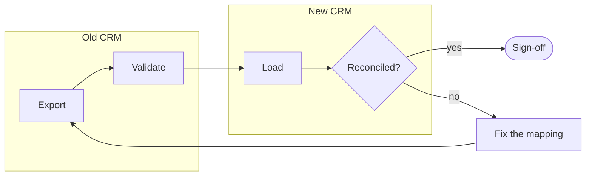
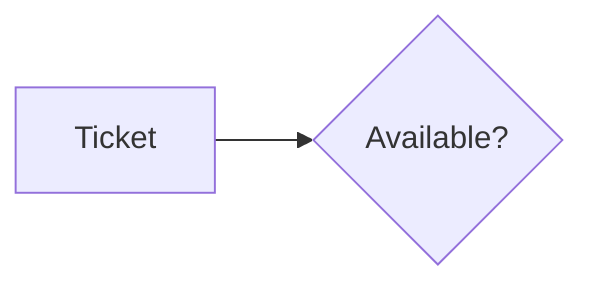

# markdown2pptx

Turns a Markdown file into a PowerPoint deck **built on your own template**: its layouts, theme
colours, fonts, slide size, footer and page numbers. Headings become the chapters and slide
titles, `mermaid` code blocks become **native, editable PowerPoint shapes** (flowcharts, sequence
diagrams, Gantt charts, drawn by [mermaid2pptx](https://github.com/JeanMichelDurand/mermaid2pptx)),
tables native tables, lists real bullets, and `::: notes` the speaker notes.

```sh
markdown2pptx talk.md                          # -> talk.pptx, on PowerPoint's default look
markdown2pptx talk.md --template brand.pptx    # -> on your company's template
```

Two dependencies (`python-pptx`, `mermaid2pptx`). Runs on Windows, Linux and macOS, or in the
browser. PowerPoint is only needed to open the result.

Sibling of [mermaid2pptx](https://github.com/JeanMichelDurand/mermaid2pptx) (one diagram → one
slide) and [jupy2pptx](https://github.com/JeanMichelDurand/jupy2pptx) (a notebook → a deck).

## Example

Two slides of [`examples/project-plan.md`](examples/project-plan.md), a project kick-off:

````markdown
## How the data moves



Each trial migration runs this loop until the counts and totals match.

## Who does what

| Task                 | Sales ops | IT | Sales managers | Vendor |
|:---------------------|:---------:|:--:|:--------------:|:------:|
| Data cleaning        |     R     | C  |       A        |        |
| CRM configuration    |     A     | C  |       C        |   R    |
…

R: responsible, A: accountable, C: consulted, I: informed.
````

`markdown2pptx project-plan.md` draws them as below, on PowerPoint's default look: the diagram is
native shapes you can move and restyle, the table a native table that keeps the centred columns.
With `--template`, the same slides take your template's fonts, colours and layouts.

| `## How the data moves` | `## Who does what` |
|---|---|
|  |  |

The [examples](examples/) folder has five talks, each a full deck (title, contents, chapters);
the [browser version](https://jeanmicheldurand.github.io/markdown2pptx/) loads any of them:

| Example | Shows |
|---|---|
| [`talk.md`](examples/talk.md) | a proposal: flowchart, sequence diagram, Gantt chart, callout, `---` slide break |
| [`incident-review.md`](examples/incident-review.md) | a post-incident review: a picture, a timeline table, a task list |
| [`project-plan.md`](examples/project-plan.md) | a project kick-off: Gantt with milestones, subgraphs, a centred RACI table |
| [`architecture.md`](examples/architecture.md) | an architecture review: `classDef` colours, a JSON code block, an options table |
| [`git-training.md`](examples/git-training.md) | a training session: shell commands, inline code, a numbered exercise, a checklist |

| Picture (``) | Sequence diagram |
|---|---|
|  |  |

## Install

Pick one:

- **No install at all:** the [browser version](https://jeanmicheldurand.github.io/markdown2pptx/)
  runs in the page: paste or open your Markdown (and its images), choose a template, download the
  deck. Your files never leave your computer.
- **A single executable**, no Python needed: download it from the
  [latest release](https://github.com/JeanMichelDurand/markdown2pptx/releases/latest)
  (Windows, Linux, macOS). On Windows, double-click it to choose files, or drop `.md` files on it.
- **With Python 3.10 or later:** `pipx install markdown2pptx` (or `uv tool install markdown2pptx`).
- **From a copy of this folder:** `python3 install.py` (Windows: `py install.py`), then `./markdown2pptx`
  (Windows: `markdown2pptx.bat`).

## Usage

```text
markdown2pptx FILE.md [-o OUT.pptx] [--template DECK] [options]
```

| Option | Meaning |
|---|---|
| `FILE.md` | the Markdown file, UTF-8; `-` for standard input |
| `-o`, `--output` | the deck to write (default: the input's name with `.pptx`) |
| `--template DECK` | a `.pptx` or `.potx`: the deck takes its theme, fonts, layouts and slide size (default: `$MARKDOWN2PPTX_TEMPLATE`; `--template ""` for none) |
| `--title`, `--subtitle` | the title slide (default: the front matter's, else the document's only `#` heading) |
| `--author` | the document's author (default: the front matter's, else `$MARKDOWN2PPTX_AUTHOR`) |
| `--aspect 16:9\|4:3` | slide shape without a template (16:9) |
| `--slide-level N` | the heading level that starts a slide (default: found, see below) |
| `--no-contents` | no contents slide (there is one when the deck has two chapters or more) |
| `--max-rows`, `--max-columns` | table rows (15) and columns (8) on a slide; the footer says what was cut |
| `--mermaid-color` | diagram colours: `theme` (the deck's, the default), `purple`, `slate` or `#RRGGBB` |
| `--mermaid-render bpmn` | flowcharts read as a simplified BPMN process (gateways, events, swim lanes) |
| `--version` | print the version |

Images are read relative to the Markdown file. Exit code 0 when the deck was written; warnings
(an image not found, text that does not fit, a diagram that could not be drawn) go to standard
error, one line each.

From Python:

```python
from markdown2pptx import Options, convert
prs, deck = convert(open("talk.md", encoding="utf-8").read(),
                    Options(template=open("brand.pptx", "rb").read()))
prs.save("talk.pptx")
print(deck.summary(), deck.warnings)
```

## Markdown conventions

~~~markdown
---
title: Moving to self-service reporting      # the title slide (also: subtitle, author)
---

# Why change                                 # a chapter: a section-header slide, a contents line

## Where we are                              # a slide with this title

- bullets, **bold**, *italic*, `code`, [links](https://example.org)
  - nested levels

::: notes
What to say: the slide's speaker notes. An HTML comment <!-- … --> is a note too.
:::

## How a request flows                       # one visual a slide: a diagram, a table or a picture



---                                          # a new slide with the same title
~~~

- **Title.** The front matter's `title`, else the document's `#` heading when it comes first and
  is the only one at its level; a short line right under it is the subtitle. Else the file name.
- **Slides.** The *slide level* is the highest heading level followed directly by content (as
  pandoc reads it): with `#` chapters and `##` slides it is 2, with `##` headings only it is 2
  too, and every `##` is a slide. Headings above it are chapters, headings below it bold
  sub-headings on the slide. `--slide-level` sets it. A `---` line starts a new slide under the
  same title.
- **Visuals.** A slide holds one: a Mermaid diagram, a table, or an image on its own line. A
  second one starts a new slide under the same title. Text on the slide goes above the visual
  when it is short, else in a column on its right.
- **Text slides** use the template's *Title and Content* layout: its body placeholder, its
  bullets and indents per level. The text size starts at the template's and shrinks until the
  text fits; when it cannot, a warning says to split the slide.
- **Mermaid.** `flowchart`/`graph`, `sequenceDiagram` and `gantt`, drawn by mermaid2pptx as
  autoshapes and connectors glued to them, one group per diagram: move a box and its arrows
  follow. With `--mermaid-color theme` they take the template's colours and font. A diagram type
  mermaid2pptx does not read (pie, class, state…) is shown as its source, with a warning.
- **Tables.** GitHub tables, with their column alignment (`:--`, `:-:`, `--:`); numbers are
  right-aligned when no alignment is given. The template's table style colours them.
- **Images.** PNG, JPEG, GIF, BMP or TIFF, next to the Markdown file (``
  or ``), the alt text kept for screen readers. SVG and web images are not read: a
  warning says so and the alt text is shown.
- **Also read:** numbered and task lists, block quotes and GitHub callouts (`> [!NOTE]`), fenced
  code (monospace), `~~strike~~`, HTML entities. Not read: footnotes, math, raw HTML layout.

## What the template gives

The layouts are found by PowerPoint's layout *type*, which survives renaming and translation
(*Titre de section* is still a section header): *Title Slide* for the title, *Section Header*
for chapters, *Title and Content* for text slides, *Title Only* for visuals. The first layout of
each type wins, so moving one first in the Slide Master view chooses it. The template's sample
slides are dropped. The footer and the slide number go into the layout's own placeholders when it
has them, so they sit and look as the template designed them.

## Development

```sh
python3 install.py dev          # Windows: py install.py dev
.venv/bin/python -m pytest      # Windows: .venv\Scripts\python.exe -m pytest
.venv/bin/ruff check .
```

See [CONTRIBUTING.md](CONTRIBUTING.md) for the conventions and the code map.

## Releasing

1. Record the changes under a new version heading in [CHANGELOG.md](CHANGELOG.md).
2. Bump `__version__` in `src/markdown2pptx/__init__.py`, open a pull request and merge it into `main`.
3. Tag the merged commit, not your branch:
   `git switch main && git pull && git tag v1.2.3 && git push origin v1.2.3`.

The `release` workflow stops at once if the tag and `__version__` differ; otherwise it runs the
tests, builds and smoke-tests one executable per system, attaches them to a GitHub release and
publishes the package to PyPI. The `pages` workflow deploys the browser version from the same tag.

## Licence

[MIT](LICENSE), provided as is, without warranty.
