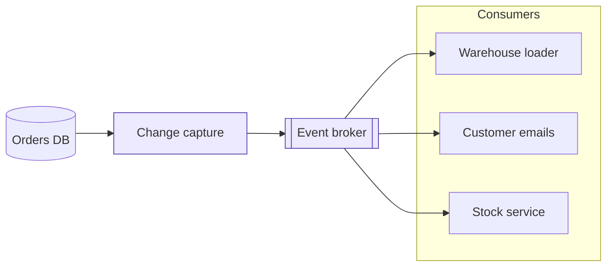

# Context

## The problem

- Six systems poll the orders database **every minute** to find what changed
- The polling is 40% of the database's load at peak
- A change takes up to 5 minutes to reach the warehouse and the customer emails
- Each team has written its own change detection, with its own bugs

## Options considered

| Option                       | Latency | Effort | Database load | Verdict    |
|:-----------------------------|--------:|-------:|--------------:|:-----------|
| Faster polling               |   30 s  |    low |        higher | rejected   |
| Database triggers            |    1 s  | medium |          some | rejected   |
| Change data capture + broker |    2 s  | medium |          none | **chosen** |
| Events from the order service|  < 1 s  |   high |          none | later      |

# The design

## Overview



Change capture reads the database's log, so the orders database does no extra work.

## The event

Every change to an order publishes one event, keyed by the order id so that its events stay in order:

```json
{
  "type": "order.status_changed",
  "order_id": "O-2026-118734",
  "from": "paid",
  "to": "shipped",
  "at": "2026-03-14T13:42:07Z",
  "version": 7
}
```

## Guarantees

- **At least once**: a consumer can see an event twice, so it skips any `version` it already has
- **In order per order**: events for one order arrive in the order they happened
- **Kept 7 days**: a consumer that stops can catch up for a week
- **Schema checked**: a producer cannot publish an event the registry rejects

> A consumer that needs more than the event holds reads the order service's API, never the database.

# Decision

## What we ask for

1. Approve change data capture with a managed event broker
2. Two engineers for one quarter to build it and move the first two consumers
3. Each other team moves its consumer within the following quarter

<!-- The cost estimate is in the appendix of the written proposal; bring a printed copy. -->
