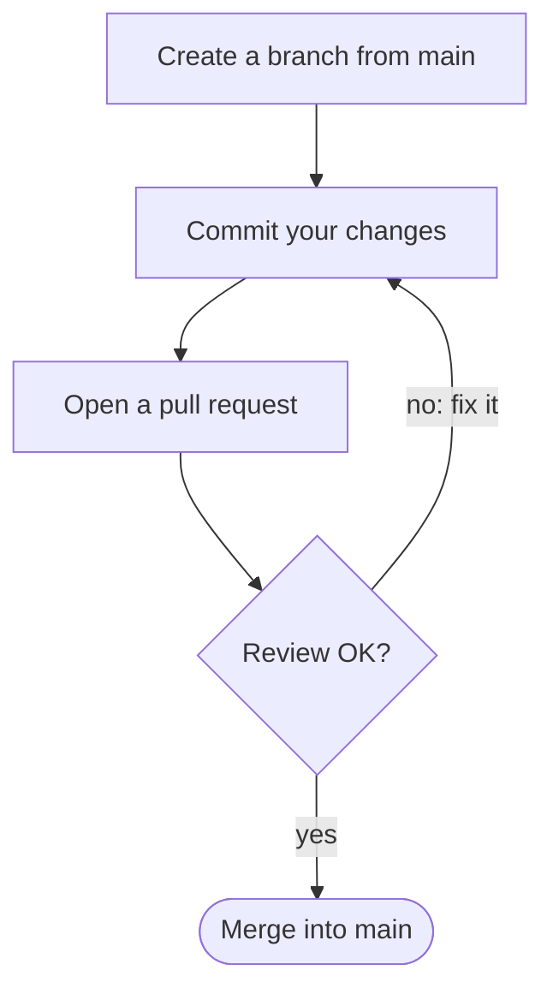

# The basics

## Why version control

- Every change to a query or a notebook is **kept, dated and explained**
- You can go back to the version that produced last month's numbers
- Two people can work on the same project without emailing files
- A colleague reviews the change *before* it reaches the dashboard

## Your first commands

```sh
git clone https://example.com/analytics/sales-reports.git
cd sales-reports
git status                 # what changed since the last commit
git add revenue.sql        # choose what goes in the next commit
git commit -m "Revenue: exclude test orders"
git push                   # share it
```

---

Read `git status` before every commit: it shows what is about to go in.

- **Untracked**: a new file Git does not follow yet
- **Modified**: changed, not yet chosen with `git add`
- **Staged**: chosen, goes into the next commit

# Working with others

## The branch workflow



Every change reaches `main` through a review.

## Good commit messages

| Weak               | Better                                        |
|:-------------------|:----------------------------------------------|
| `fix`              | `Churn: count trial users only once`          |
| `update query`     | `Revenue: exclude test orders`                |
| `changes`          | `Sales dashboard: add the region filter`      |

A message says **what** changed and **why**, in a line someone can read in six months.

# Practice

## Exercise

1. Clone the training repository
2. Create a branch named after you: `git switch -c your-name`
3. Fix the typo in `README.md` and commit it
4. Push the branch and open a pull request
5. Review your neighbour's pull request

::: notes
Pair people up for step 5. Allow 20 minutes; walk around the room during steps 2 and 4,
where most people get stuck.
:::

## Checklist before you leave

- [ ] Git is installed and `git --version` works
- [ ] You can clone a repository
- [ ] You have opened one pull request
- [ ] You know where to ask: the *#analytics-help* channel
