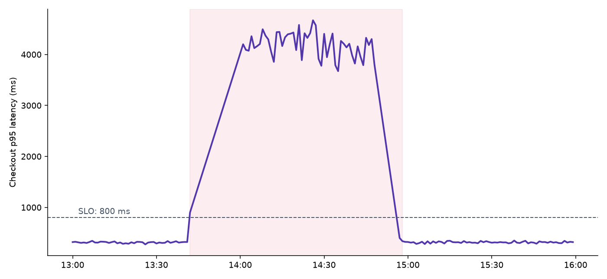
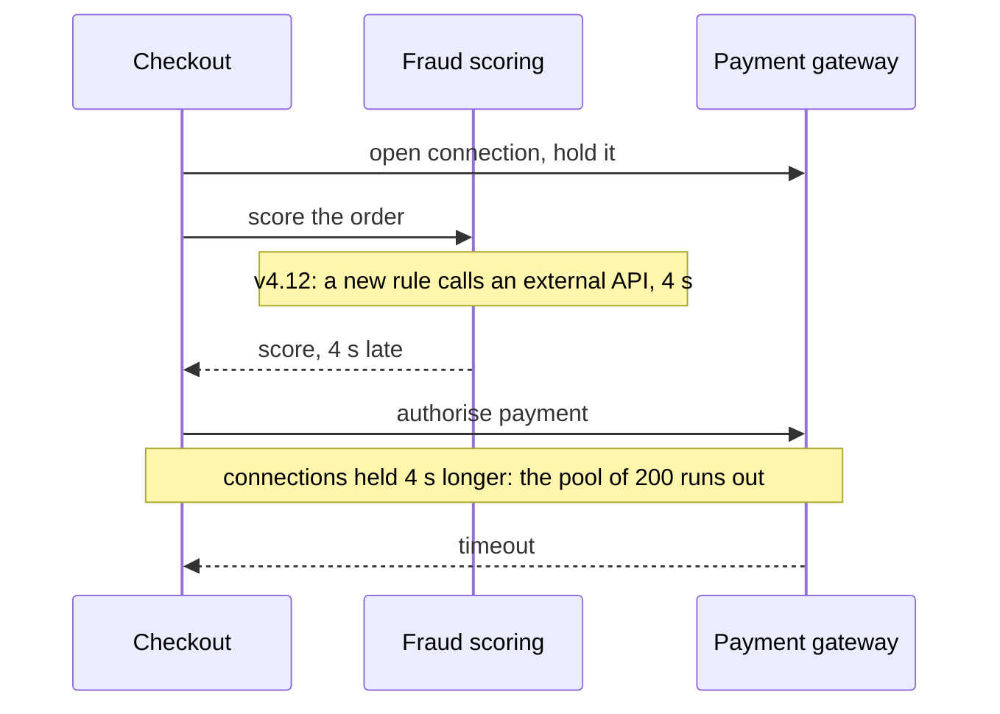

# What happened

## Impact

- Checkout was **degraded for 76 minutes**, 13:42 to 14:58
- 18% of payment attempts failed; most customers retried and paid
- Estimated lost orders: **1,150** (about €61k of revenue)
- No data was lost and no card was charged twice

::: notes
Lead with the customer impact. The double-charge question always comes first: answer it before anyone asks.
:::

## Latency during the incident

## Timeline

| Time  | Event                                              |
|:------|:---------------------------------------------------|
| 13:30 | Fraud-scoring service deployed (v4.12)             |
| 13:42 | p95 latency crosses the 800 ms SLO                 |
| 13:51 | On-call paged by the latency alert                 |
| 14:20 | Payment gateway connection pool found exhausted    |
| 14:41 | v4.12 rolled back                                  |
| 14:58 | Latency back under the SLO, incident closed        |

# Why it happened

## The failure chain

Checkout held a gateway connection while it waited for the fraud score.

## Contributing factors

1. The new fraud rule had no timeout on its external call
2. Load tests run against a stub of the external API, which answers in 5 ms
3. The latency alert fires after 9 minutes above the SLO, by design, to avoid noise
4. Rolling back needed a second approver, who was in a meeting

> [!IMPORTANT]
> The root cause is the order of calls in checkout, not the fraud rule: any slow dependency would have
> exhausted the pool the same way.

# What we change

## Actions

- [x] Timeout of 300 ms on every fraud-rule external call (done 15 March)
- [x] Open the gateway connection only after scoring (done 18 March)
- [ ] Load tests with realistic latency on external stubs, owner: QA lead, by April
- [ ] One-person rollback for the on-call engineer, owner: platform team, by April
- [ ] Alert on pool usage above 80%, owner: SRE, by end of March

<!-- Ask the owners to confirm the dates in the room. -->
