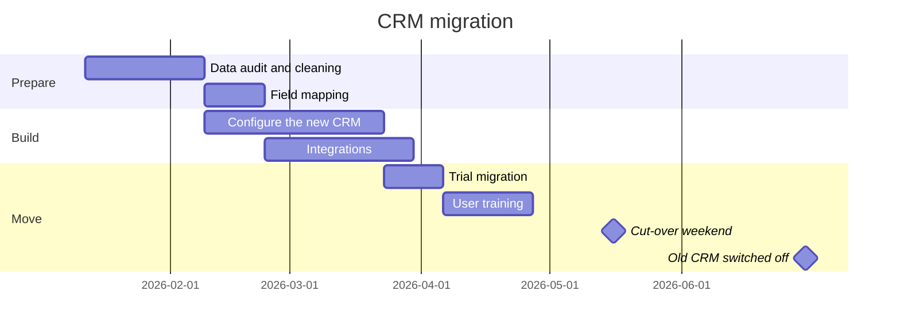
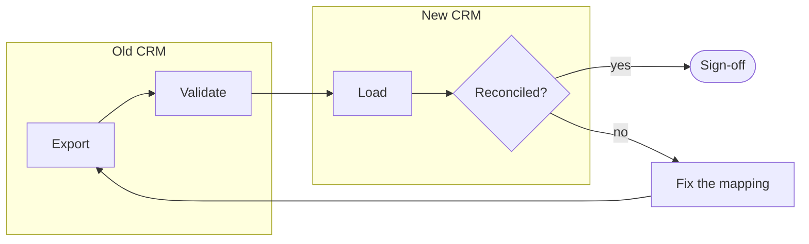

# The project

## Goals

- Move **all 42,000 accounts** and their history to the new CRM by the end of June
- Retire the old CRM and its licences: €180k a year
- Keep sales running: no more than one weekend of downtime

## Scope

| In scope                         | Out of scope                     |
|:---------------------------------|:---------------------------------|
| Accounts, contacts, opportunities | Marketing campaigns (phase 2)   |
| Five years of activity history   | Older history: archived as files |
| Quote templates                  | Custom reports: rebuilt on demand |
| Outlook and phone integration    | The partner portal               |

# The plan

## Timeline

## How the data moves

Each trial migration runs this loop until the counts and totals match.

## Who does what

| Task                 | Sales ops | IT | Sales managers | Vendor |
|:---------------------|:---------:|:--:|:--------------:|:------:|
| Data cleaning        |     R     | C  |       A        |        |
| CRM configuration    |     A     | C  |       C        |   R    |
| Integrations         |     C     | R  |                |   C    |
| Training             |     R     |    |       A        |   C    |
| Cut-over             |     A     | R  |       I        |   R    |

R: responsible, A: accountable, C: consulted, I: informed.

# Next steps

## This month

1. Name a data owner in each sales region
2. Freeze changes to the old CRM's fields
3. Book the cut-over weekend with the vendor
4. Send the first newsletter to the sales teams

::: notes
Ask each regional manager for their data owner's name before the end of the meeting.
:::
