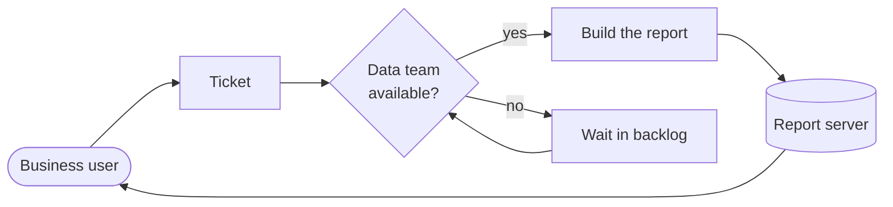
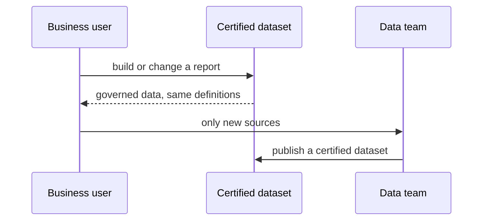
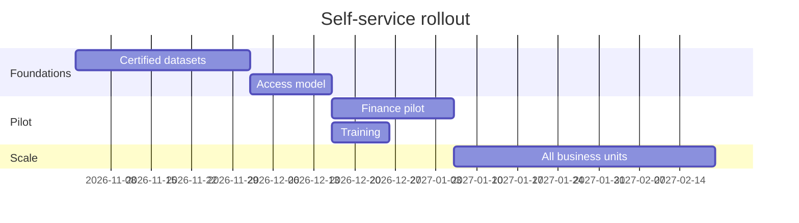

# Why change

## Where we are

- 140 report requests a month reach the data team
- **Median wait: 9 days**, a third of them for a filter or a column
- Analysts spend *most* of their week on extracts, not analysis
  - two people full time on recurring exports
  - no time left for the forecasting work

::: notes
Open with the wait time: it is the number the business units quote back to us.
:::

## What users ask for

| Request type        | Share | Median wait |
|:--------------------|------:|------------:|
| New column / filter |   34% |      6 days |
| New report          |   27% |     15 days |
| Data extract        |   22% |      4 days |
| Access request      |   17% |      2 days |

Two thirds of the requests change an existing report.

# The proposal

## How a request flows today

## With self-service

The data team curates datasets; users build their own reports on them.

## Rollout plan

## What we need

1. Two weeks of a security engineer for the access model
2. Licences for **25 report authors**
3. A sponsor in each business unit

> [!NOTE]
> The licences replace the current extract tool, so the running cost stays flat.

---

### Decision requested today

Approve the pilot with Finance, starting **2 November**.

<!-- Ask for the decision before questions: the committee has 20 minutes. -->
